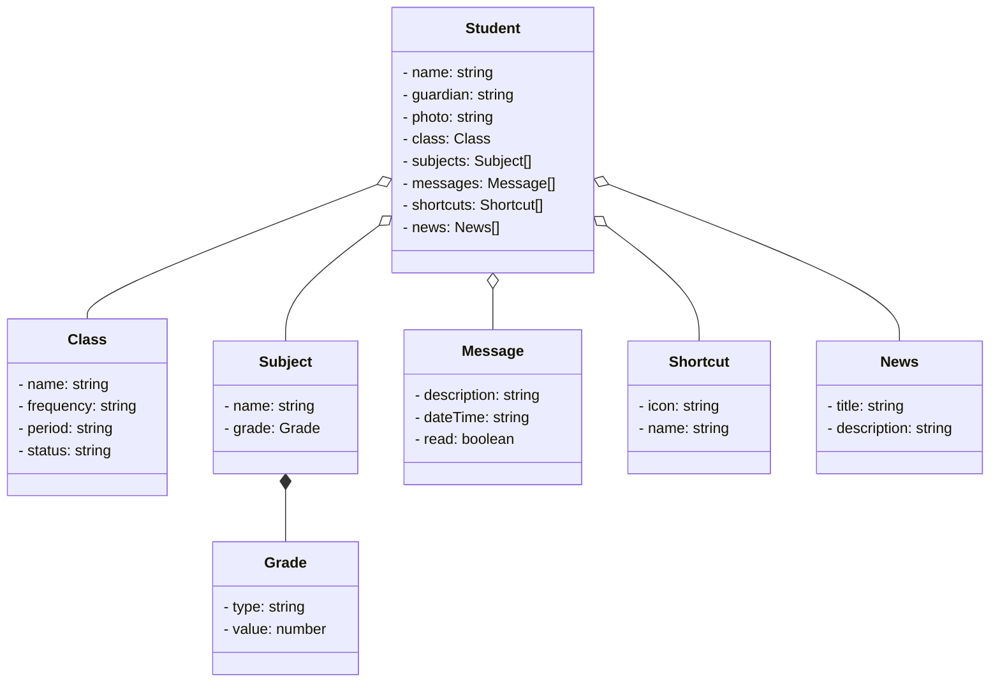
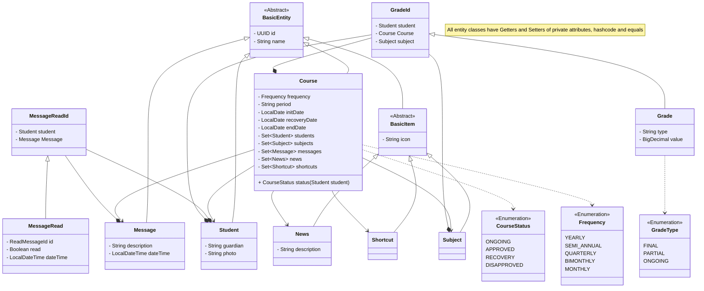

![technology Java](https://img.shields.io/static/v1?color=red&label=Technology&message=Java&style=for-the-badge&logo=data:image/png;base64,iVBORw0KGgoAAAANSUhEUgAAAC0AAAAtCAYAAAA6GuKaAAAABGdBTUEAAK/INwWK6QAAABl0RVh0U29mdHdhcmUAQWRvYmUgSW1hZ2VSZWFkeXHJZTwAAAZRSURBVHjaYvz//z8DzQEjoziQnALECQz//3+l1DiAAGJioA/4BsSuQBxADcMAAohejgbZwwPEHtQwDCCA6OVoJSBmBmJ1YFJhptQwgACil6PdoTQb1PEUAYAAYqJTJsyA8l4A8W9KjQQIICYaO5gfSM4GYnmoyGEGKhRXAAEENoMmmIHBBIhPAfF/KH4CxDLUMBsggGjl4BQgfovk4L9AHEAt8wECiNqOFQbiJUiOheEsJDXsUE9lkWsPQABR08EaQHwCzbHfgTgVzbGXoNiBXLsAAohaDpYH4ptoDn4BxO5QeQcgPgYV3w3EopTYBxBA1HAwDxAfRXPwBSDWgcp3A/EfqPhUIGal1E6AAKKGoyvRHLwPiCXAjmNgWIck3gvEjNSIWYAAotTBgkD8GMlhx4GYHyo3GUl8EzUzPEAAUepoL7RiDZaGTYH4N1T8KxBrUtPRAAFEaY3Ij8T+C8TPoWxLIGaBsr8D8UNqVrQAAUSpo28B8T8oG+RISSj7C5IaISCOpqajAQKIUkdfhmJwSwOINaDsC9CQh4nXA9sh0tRyNEAAMVHYcPkFbRDBgAWUvgjE55DEQQ4uppajAQKIGkUeFxAfgWa650AsABUPRisKXwOxCDUyIkAAUatG1AbiV1DHJSCJz0YrXfSpYR9AAFGz7eEExJ+B+Ay8EmFg4ATic1BHv6G0+oZhgABiomI62wckI4FYFYi9oGKg4u4BVMVsIP81js6CFBA7AbEbMRkWIIAYie5IMDJyA0ltINaE9kRkof29M0DHTENSZwUk2YFi+6F67kO7WbZAsY9YumK9QBwC1gMBr4C4DKh2IS6nAAQQMdHOCMSJQHwDqZYDZbhZQBwJxIp49PoA8QFwOxtVnAmIxaE4GojLkDLzf6g9prjMBQggwiHNyAgK0UdoAy8TgHgvEL+BdlRBhvyB0szQioYNPGQA4X+DVjxSQKwIja0PQBwFdMVLqD0gPe1AXAK1Zy5QLgWbkwACiJiQ5gbi7Vh6IyD8D4h/AfEPIP4GxaCG/09oc/QPFj0vgbgLiKWw2GUILWVA6p7hchNAALEQkcG+AkMhCMiKBeJAIDYFYk5oCILSISse3X+gsXEJiI8A8SEgPgk08wsO9d5IFd4lXIYCBBAjyT16yLCAG9QDx4H4JzQpMEId+RPa9ngLxM/ASYuYQUdGRhcguQbaCAMlORegvkPYlAIEEDnlcQUQP4U29nkIqGUGYjkg9gTiGiBeBMS+WNQ5A/EHaLIAJbEYfOYCBBBpIc3IyAEkbwKxHDQ0QJnoKRC/A+If0EYSKMlxAbEgNPOJADEHmkmgDFcNcQFjBnQYGJTcdgJxK1D8MD5nAAQQOSFtB8R7oBnuP5H4J7SHsxvaowEVlSxA3A6t/lfAOxBEYIAAYiR7lIqRURLaqoNVNkLQUP4JLc5ewtM0A8M9IH4MtPEbkn5QhjOCpvlXpFgNEEDkOZqRkRfasNcC4haiLGVkZIM2ZSkGAAHEQqa+OqRKwADooCPgkISUGN+haZsXmvZVoNU/qH0xCUjPQglxMgBAAJHbomslIT2j4/NALE1JKw8ggFiIKJNVoRhUnYMaQAeBuANaNUdAQ5KDQNj8hjaaTgDxHiD+iMM+NWga/4HPMIAAwp6mGRlB0VoLxJ7QogvUm94P7UbtBRp6F6qOHdqWUIW2K0CZkQ+a7EAWv4dmxtvgTvD//5/xBBDInh3gCub//258jgYIIFzRfxApOt+CRzhBLTLqdRi4wK1DYM0KxEVAvAzaHQPZFw5vCeLQDxBAuEK6AdyDRgVfoZntJrQYew6tVD5Dk8pPaDX+D6mVxwHNkPzQSkYKmjlhMYM8/3IAiNvAbRNQBQNspAFduA1bQAMEEL7QCIVWIp8oyHT4KptbQLwAiGOBWB3cFWNgSALiu9BmAs5ZA4AAIqY9rQCtQJSQ2sRcSCHJAm2ZMUEbTb+gGe83NAZAme4TNH2DKhxQl+sJtFElADXbEYj9oLFxDVwH/P9/AZeTAAKI1LaHMJCcBI1yVqiD/0Az3S9o+fwbqUMAw0xQD4IyqRh0HEQKbdwFNE6yDFqOf8bnDIAAItXRrFDLlKFFnSLUAaC+nig07fJC29us0DT7D+qRr9AQfwvND0+h/UdQSXQVXNX///+XGGcABBgAIku3g4p9ZV8AAAAASUVORK5CYII=)

# API Escola Shining Stars (ESS) 🌟

RESTful Desenvolvimento da API para projeto do bootcamp Java AI Powered da DIO.

Construída com Java 21 e Spring Boot 3.2.3.

## Principais tecnologias
- **Java 21**: Versão LTS mais recente do Java para tirar vantagem das últimas inovações que essa linguagem robusta e amplamente utilizada oferece;
- **Spring Boot 3**: Versão do Spring Boot, que maximiza a produtividade do desenvolvedor por meio de sua poderosa premissa de autoconfiguração;
- **Spring Data JPA**: Ferramenta pode simplificar a camada de acesso aos dados, facilitando a integração com bancos de dados SQL;

## 🖼️ Amostra com Figma

O projeto iniciou com a montagem de uma amostra da aplicação utilizando o Figma para ser base para a abstração de informações para dar seguimento ao projeto.  
🔗 [Amostra no Figma](https://www.figma.com/file/w9kOfqdYnPNcMxunBX5LGQ/ESS?type=design&node-id=0-1&mode=design)

## 💡 Diagrama de Classes (Domínio da API)

Diagrama de classes com sintaxe [Mermaid], criado a partir da abstração de atributos em JSON com base na amostra do Figma e prompt com Microsoft Copilot. 

  
Ver diagrama de classes criado com Microsoft Copilot

  
Prompt utilizado no Microsoft Copilot

  Gere um diagrama de classes (usando a sintaxe Mermaid) tendo em vista o seguinte JSON que repretanta um aluno de uma escola. Inclua as relações entre as classes. Traduza os nomes das classes e atributos para o inglês. Mantenha uma estrutura simples e fiel ao modelo que vou passar:
  {
    "nome": "Maria",
    "responsavel": "João",
    "foto": "urlFoto",
    "turma": {
      "nome": "1º Ano - A",
      "periodicidade": "Anual",
      "periodo": "2024",
      "status": "Em curso"
    },
    "materias": [
      {
        "nome": "Português",
        "nota": {
          "tipo": "Final",
          "valor": 10
        }
      },
      {
        "nome": "Matemática",
        "nota": {
          "tipo": "Final",
          "valor": 10
        }
      },
          {
        "nome": "Ciências",
        "nota": {
          "tipo": "Em curso",
          "valor": 0
        }
      }
    ],
    "mensagens":[
      {
        "descricao": "Lorem ipsum dolor sit amet, consectetur adipiscing elit.",
        "dataHora": "2024-03-02T13:02:34.000Z",
        "lida": false
      },
      {
        "descricao": "Lorem ipsum dolor sit amet, consectetur adipiscing elit.",
        "dataHora": "2024-03-01T08:02:34.000Z",
        "lida": true
      }
    ],
    "atalhos": [
      {
        "icone": "urlIcone",
        "nome": "Conferir Pagamentos"
      },
      {
        "icone": "urlIcone2",
        "nome": "Falar com a Secretaria"
      },
      {
        "icone": "urlIcone3",
        "nome": "Autorizar Saída"
      }
    ],
    "novidades": [
      {
        "titulo": "Confira o calendário escolar",
        "descricao": "Veja os feriados, data das provas e das férias."
      },
      {
        "titulo": "Ensino Integral",
        "descricao": "Veja aqui as atividades programadas para o período da tarde."
      }
    ]
  }

Com base no diagrama criado pela IA e a documentação do [Mermaid], o diagrama foi editado para deixar as classes no padrão Java e criar as relações para o JPA:

O legal desta etapa foi ver que, apesar de no modelo do Figma ter o **Estudante** como base, o domínio central pode ser o **Curso** para facilitar as relações.

[Mermaid]: https://mermaid.js.org/