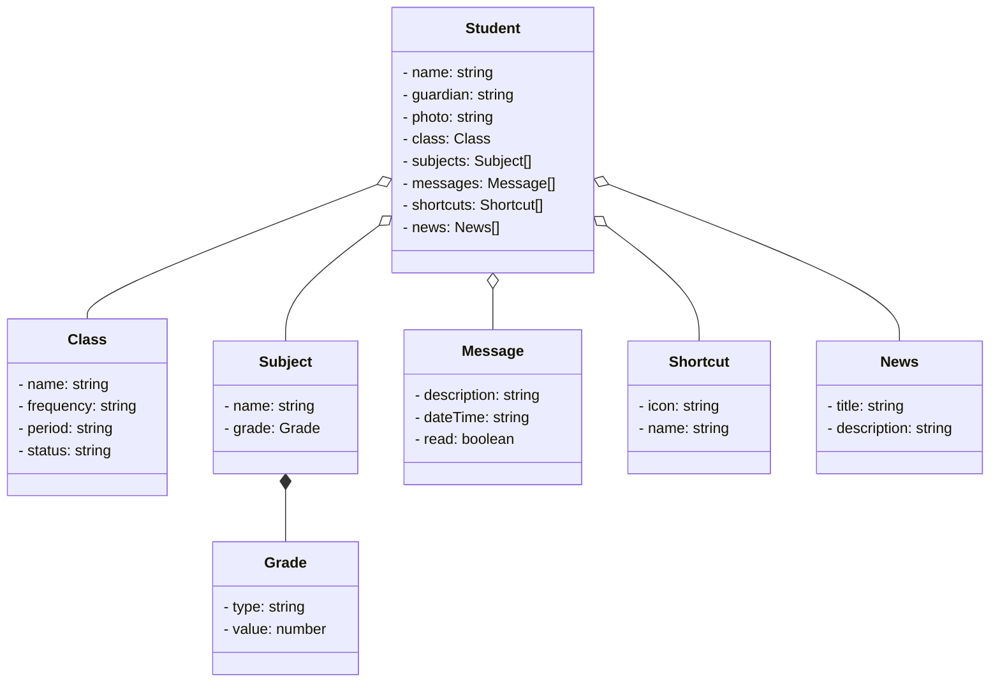
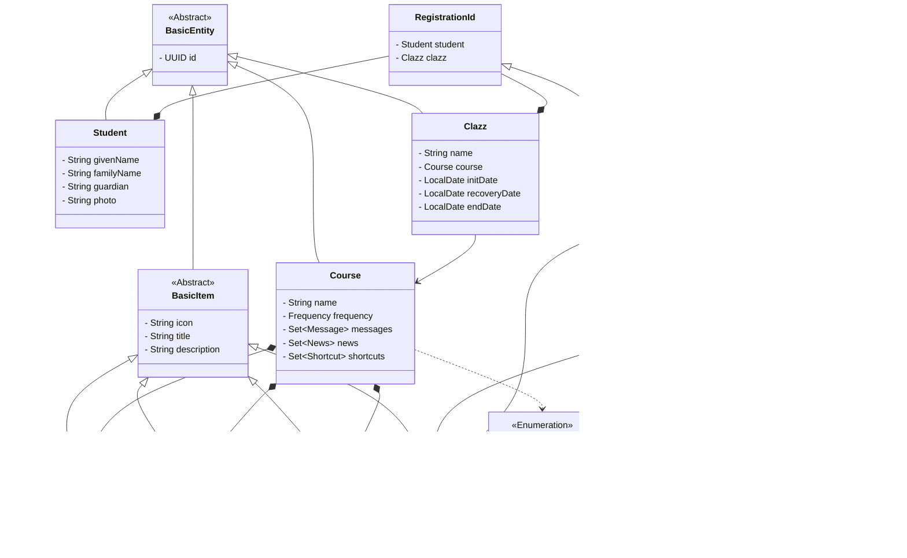

[](https://github.com/didifive/ess-api/commits/master)
[](https://www.linkedin.com/in/luis-carlos-zancanela/)


![technology Java](https://img.shields.io/static/v1?color=red&label=Technology&message=Java&style=for-the-badge&logo=)


# API Escola Shining Stars (ESS) 🌟

RESTful Desenvolvimento da API para projeto do bootcamp Java AI Powered da DIO.

Construída com Java 21 e Spring Boot 3.2.3.

---

## 🎯 Objetivo 
Este é um projeto de API criado a partir de desafio de projeto do bootcamp Java AI Powered da DIO.  
O primeiro desafio foi fazer uma abstração de um JSON que atendesse uma tela de amostra de uma aplicação feita no Figma, sem seguida
gerar diagrama de classe com a sintaxe mermaid utilizando prompt em uma IA Generativa (por exemplo, ChatGPT) com o JSON criado.
Com a resposta, aprimorei o diagrama para criar uma API que pode atender uma situação problema real para cadastro e controle
de estudantes, cursos, turmas, matrículas e notas e atenda à tela da amostra.  
Aqui foram abordadas as etapas:  
- Amostra com Figma: visual de uma tela de aplicativo, no caso, um aplicativo que mostra notas de um aluno.
- Diagrama de classes: Utilizando IA para elaorar diagrama de classes através de um JSON extraído conforme amostra.
- Criação da API **ESS** 
- Criação de conta e de banco de dados Postgres utilizando a plataforma [Railway]

### 🏫 O que é ESS API
As sigla ESS foi formada pelo nome Escola Shining Star, nome criado para representar o produto deste projeto.  
A API foi construída com Java e SpringBoot com objetivo de gerar cadastro e controle para estudantes, cursos, turmas,
matrículas e notas que uma instituição que possui serviços compatíveis possa utilizar.  
Este projeto disponibiliza Endpoints que viabilizam o cadastro e controle. Os endpoints estão documentados com
swagger e também estão configurados em coleção do postman para serem utilizados com o aplicativo para realizar as chamadas
e testes.

---

## 🔧 Principais tecnologias utilizadas
- **Java 21**: Versão LTS mais recente do Java para tirar vantagem das últimas inovações que essa linguagem robusta e amplamente utilizada oferece;
- **Spring Boot 3**: Versão do Spring Boot, que maximiza a produtividade do desenvolvedor por meio de sua poderosa premissa de autoconfiguração;
- **Spring Data JPA**: Ferramenta pode simplificar a camada de acesso aos dados, facilitando a integração com bancos de dados SQL;

---

## 🖼️ Amostra com Figma

O projeto iniciou com a montagem de uma amostra da aplicação utilizando o Figma para ser base para a abstração de informações para dar seguimento ao projeto.  
🔗 [Amostra no Figma](https://www.figma.com/file/w9kOfqdYnPNcMxunBX5LGQ/ESS?type=design&node-id=0-1&mode=design)

---

## 💡 Diagrama de Classes (Domínio da API)

Diagrama de classes com sintaxe [Mermaid], criado a partir da abstração de atributos em JSON com base na amostra do Figma e prompt com Microsoft Copilot. 

<details>
  <summary>Ver diagrama de classes criado com Microsoft Copilot</summary>


```mermaid
classDiagram
  class Student {
    - name: string
    - guardian: string
    - photo: string
    - class: Class
    - subjects: Subject[]
    - messages: Message[]
    - shortcuts: Shortcut[]
    - news: News[]
  }
  class Class {
    - name: string
    - frequency: string
    - period: string
    - status: string
  }
  class Subject {
    - name: string
    - grade: Grade
  }
  class Grade {
    - type: string
    - value: number
  }
  class Message {
    - description: string
    - dateTime: string
    - read: boolean
  }
  class Shortcut {
    - icon: string
    - name: string
  }
  class News {
    - title: string
    - description: string
  }

  Student o-- Class
  Student o-- Subject
  Subject *-- Grade
  Student o-- Message
  Student o-- Shortcut
  Student o-- News
``` 

</details>

<details>
  <summary>Prompt utilizado no Microsoft Copilot</summary>
  Gere um diagrama de classes (usando a sintaxe Mermaid) tendo em vista o seguinte JSON que repretanta um aluno de uma escola. Inclua as relações entre as classes. Traduza os nomes das classes e atributos para o inglês. Mantenha uma estrutura simples e fiel ao modelo que vou passar:
  {
    "nome": "Maria",
    "responsavel": "João",
    "foto": "urlFoto",
    "turma": {
      "nome": "1º Ano - A",
      "periodicidade": "Anual",
      "periodo": "2024",
      "status": "Em curso"
    },
    "materias": [
      {
        "nome": "Português",
        "nota": {
          "tipo": "Final",
          "valor": 10
        }
      },
      {
        "nome": "Matemática",
        "nota": {
          "tipo": "Final",
          "valor": 10
        }
      },
          {
        "nome": "Ciências",
        "nota": {
          "tipo": "Em curso",
          "valor": 0
        }
      }
    ],
    "mensagens":[
      {
        "descricao": "Lorem ipsum dolor sit amet, consectetur adipiscing elit.",
        "dataHora": "2024-03-02T13:02:34.000Z",
        "lida": false
      },
      {
        "descricao": "Lorem ipsum dolor sit amet, consectetur adipiscing elit.",
        "dataHora": "2024-03-01T08:02:34.000Z",
        "lida": true
      }
    ],
    "atalhos": [
      {
        "icone": "urlIcone",
        "nome": "Conferir Pagamentos"
      },
      {
        "icone": "urlIcone2",
        "nome": "Falar com a Secretaria"
      },
      {
        "icone": "urlIcone3",
        "nome": "Autorizar Saída"
      }
    ],
    "novidades": [
      {
        "titulo": "Confira o calendário escolar",
        "descricao": "Veja os feriados, data das provas e das férias."
      },
      {
        "titulo": "Ensino Integral",
        "descricao": "Veja aqui as atividades programadas para o período da tarde."
      }
    ]
  }
</details>

Com base no diagrama criado pela IA e a documentação do [Mermaid], o diagrama foi editado para deixar as classes no padrão Java e criar as relações para o JPA:


```mermaid
classDiagram
    class BasicEntity {
    <<Abstract>>
        - UUID id
    }
    
    class BasicItem {
    <<Abstract>>
        - String icon
        - String title
        - String description
    }

    class Student {
        - String givenName
        - String familyName
        - String guardian
        - String photo
    }

    class Course {
        - String name
        - Frequency frequency
        - Set~Message~ messages
        - Set~News~ news
        - Set~Shortcut~ shortcuts
    }

    class Clazz {
        - String name
        - Course course
        - LocalDate initDate
        - LocalDate recoveryDate
        - LocalDate endDate
    }

    class RegistrationId {
        - Student student
        - Clazz clazz
    }
    
    class Registration {
        - RegistrationId id
        - Set~Subject~ subjects
        - LocalDate registrationDate
        + RegistrationStatus status()
    }

    class Frequency {
        <<Enumeration>>
        YEARLY
        SEMI_ANNUAL
        QUARTERLY
        BIMONTHLY
        MONTHLY
    }

    class RegistrationStatus {
        <<Enumeration>>
        ONGOING
        APPROVED
        RECOVERY
        DISAPPROVED
    }

    class Message {
        - LocalDateTime dateTime
    }

    class GradeId {
        - Registration registration
        - Subject subject
    }

    class Grade {
        - GradeId id
        - GradeType type
        - BigDecimal value
    }

    class GradeType {
        <<Enumeration>>
        FINAL
        PARTIAL
        ONGOING
    }

    class Shortcut {
        - String link
    }

    class News

    class Subject

    BasicEntity <|-- BasicItem
    BasicEntity <|-- Course
    BasicEntity <|-- Clazz
    BasicEntity <|-- Student
    BasicItem <|-- Message
    BasicItem <|-- News
    BasicItem <|-- Shortcut
    BasicItem <|-- Subject
    Course ..> Frequency
    Course *-- Message
    Course *-- News
    Course *-- Shortcut
    Clazz --> Course
    RegistrationId --* Student
    RegistrationId --* Clazz
    RegistrationId <|-- Registration
    Registration --> Subject
    Registration ..> RegistrationStatus
    Grade ..> GradeType
    GradeId <|-- Grade
    GradeId --* Registration
    GradeId --* Subject
``` 

O legal desta etapa foi ver que, apesar de no modelo do Figma ter o **Estudante** como base, este não era necessariamente o domínio central, existe uma dependência forte com **Curso**, **Turma** e **Matrícula** para ter a relação do estudante com as matérias e notas.

---

## 📷 Prints do Projeto

Logotipo do produto ESS Escola Shining Star  
  
  
Banner do Spring personalizado  
  

Console do H2 (banco de dados) mostrando as tabelas criadas e os dados de uma tabela de relação de muitos para muitos que relaciona o Estudante, a Turma e a Matéria matriculada   
  

Abaixo print do recurso de Postgres criado no [Railway]   
  

Retorno de erro com DTO personalizado com tratamento para timestamp, status, mensagem e path utilizando a classe `me.didi.api.ess.dtos.ApiErrorDTO`  
  

Swagger do projeto  
  

Relatório de coverage gerado pelo Jacoco  
  

Retorno de erro na validação de boby em requests, no exemplo é um POST de nova nota (grade) com o body vazio, portanto retorna os campos e respectivas mensagens:  
  

Quando utiliza chamada de POST que cria novo recurso, seja um estudante, curso, turma ou mesmo o registro da matrícula, o retorno tem
o header "Location" que possui link direto para chamar o recurso específico (_GET para findById_).  
Abaixo exemplo de retorno de cadastro de um Estudante:  
  
Abaixo exemplo de um retorno mais complexo como o Registro de Matrícula:  
  

---

## ✔️ Testes

Os testes foram feitos utilizando o [JUnit 5], Mockito e MockMVC com Hamcrest.

- Para executar os testes pode executar sua IDE ou
- Utilizando o terminal (PowerShell, Bash ou similiar), basta executar na pasta do projeto o comando abaixo:

    ```shell
    ./mvnw clean test
    ```

_Após o teste finalizado com sucesso, é possível verificar relatório de coverage em: target/site/jacoco/index.html_


## ⚙ Executando o projeto localmente

Antes de mais nada, é preciso Possuir no mínimo JDK 21 LTS instalado na máquina em que irá executar.
A execução do projeto pode ser feita utilizando atalhos de sua IDE ou com os comandos abaixo:

```shell
./mvnw clean package spring-boot:repackage
java -jar target/ess-0.0.1-SNAPSHOT.jar
```
_OBS: caso ocorra erro e estiver utilizando o terminal CMD, no primeiro comando basta remover o "./" antes do mvnw_

### OpenApi / Swagger
Para acessar a documentação do Swagger OpenAPI v3.1, acesso o link com o projeto em execução: http://localhost:8080/swagger-ui/index.html

### Postman
Neste projeto tem arquivo de coleção do Postman com os Endpoints configurados: [ESS.postman_collection.json]

### 👪 Populate
Para popular dados automaticamente foram criadas classes que executam ao iniciar a aplicação, assim a aplicação já inicia com dados básicos para gets.   
As classes estão no pacote `me.didi.api.ess.utils.populate`.

---

## 🔜 Desafios
Melhorias e desafios para aprimorar o projeto:
- Criar recurso para alterar estudantes, curso e turma
- Criar endpoint para adicionar ou remover matérias na matrícula
- Configurar paginação para os endpoints que retornam lista (findAll)
- Criar recurso para poder apagar estudantes, curso, turma, matéria, matrícula, nota, mensagem, notícia e atalho:
  - Para este caso ter atenção com a consistência de dados
  - De preferência utilizar soft delete para permitir reverter a deleção
- Aprimorar documentação OpenApi/Swagger com exemplos e descrições para os endpoints e schemas
- Observabilidade: implementar logs e métricas
- Implementar cache
- Incluir e configurar método de autenticação e autorização (por exemplo, Spring Security)
- Incluir e configurar versionamento de banco utilizando, por exemplo, flyway
- Utilizar uma solução de banco de dados diferente do H2 (MySQL, Postgres, etc)
- Criar testes de Integração
- Criar front-end/app para consumir a API
- Criar testes e2e

---

📋 Qualquer dúvida, sugestão ou crítica é só entrar em contato ou abrir uma Issue (https://github.com/didifive).  
💚 Feito com muita dedicação e aprendizado. #EnjoyThis

[Mermaid]: https://mermaid.js.org/
[Railway]: https://railway.app/
[ESS.postman_collection.json]: https://github.com/didifive/ess-api/blob/main/docs/ESS.postman_collection.json